# EE359-Multi-Graph-Matching
Python implementation of three algorithms in paper "Unifying Offline and Online Multi-graph Matching via Finding Shortest Paths on Supergraph". Homework of EE359, Prof. Junchi Yan.

<center>
#EE359 HW Report
###戴昊悦 李竞宇
###517030910{288,318}
-
</center>
### 1. Overview of the HW
In this short project we're required to implement Python code of the three algorithms proposed in [Jiang, Z., Wang, T., & Yan, J. (2020). Unifying Offline and Online Multi-graph Matching via Finding Shortest Paths on Supergraph. IEEE Transactions on Pattern Analysis and Machine Intelligence, 14(8), 1–1.](https://doi.org/10.1109/tpami.2020.2989928).

As follows we'll illustrate how we reproduce the algorithms, the result of pass test, and some of our observations.

### 2. Implementation

+ **Affinity Score**

In the graph matching synthesis, affinity score is designed to measure two-graph matching, usually written as a quadratic assignment programming (QAP) problem which is also called Lawler’s QAP:
$$
J ( \mathbf { X } ) = \min _ { \mathbf { X } \in \{ 0,1 \} ^ { n _ { 1 } \times n _ { 2 } }} \operatorname { vec } ( \mathbf { X } ) ^ { \top } \mathbf { K } \operatorname { vec } ( \mathbf { X } )  
$$
where $\mathbf { X }$ is a (partial) permutation matrix indicating the node correspondence, and $\mathbf { K } \in \mathbb{R}^{n1 n2 ×n1 n2}$ is the affinity matrix whose diagonal (off-diagonal) encodes the node-to-node affinity (edge-to-edge affinity) between two graphs. The symbol $\operatorname { vec } (·)$ here denotes the column-wise vectorization of the input matrix.

In our practice `X` is the matching result of multi graphs in shape `(num_graph, num_graph, num_node, num_node)`, where $\mathbf { X }$ in above formula is `X[i,j]`. Thus instead of calculating each pair of graphs, we can compute them in a bunch:

```python
def cal_affinity_score(X, K):
    """
    :param X: matching results, (num_graph, num_graph, num_node, num_node)
    :param K: affinity matrix, (num_graph, num_graph, num_node^2, num_node^2)
    :return: normalized affinity score, (num_graph, num_graph)
    """
    n, _, m, _ = X.shape
    vx = np.reshape(X.transpose((0, 1, 3, 2)), newshape=(n, n, -1, 1))
    vxT = vx.transpose((0, 1, 3, 2))
    affinity_score = np.matmul(np.matmul(vxT, K), vx)  # in shape (n, n, 1, 1)
    normalized_affinity_score = affinity_score.reshape(n, n) / np.max(affinity_score)
    return normalized_affinity_score
```
Note that affinity score is normalized to range `(0,1]` to be consistent with pairwise consistency.

+ **Pairwise Consistency**

In the proposed unified approaches, given $\{G_k\}_{k-1}^{N}$ and matching configuration $\mathbb{X}$, for any pair $G_i$ and $G_j$, the pairwise consistency is defined as:
$$
C _ { p } \left( \mathbf { X } _ { i j } , \mathbb { X } \right) = 1 - \frac { \sum _ { k = 1 } ^ { N } \left\| \mathbf { X } _ { i j } - \mathbf { X } _ { i k } \mathbf { X } _ { k j } \right\| _ { F }  } {2 n N } \in ( 0,1 ]
$$
Though it's defined in a `for any` way and `k` is traversed as $\sum_{k=1}^{N}$, we don't need to write the code with three `for` loop, since it's mutually independent to compute each pair $G_i$ and $G_j$, as well as the summation of `k`.

Computation of $C _ { p } \left( \mathbf { X } _ { i j }\right)$ is related to $\mathbf { X } _ { i k } \mathbf { X } _ { k j } $ for $k$ from $1$ to $N$. This is similar to the form of matrix multiplication. However we want one step before: where $\mathbf { X } _ { i k } \mathbf { X } _ { k j } $ haven't been summarized so that $\left\| \mathbf { X } _ { i j } - \mathbf { X } _ { i k } \mathbf { X } _ { k j } \right\| _ { F }$ operation can be done. Thus we use `broadcasting` in `numpy` to align shapes with additional dimensions we add. Note that we need to swap the two axes with `transpose` to achieve it:

```python
def cal_pairwise_consistency(X):
    """
    :param X: matching results, (num_graph, num_graph, num_node, num_node)
    :return: pairwise_consistency: (num_graph, num_graph)
    """
    n, _, m, _ = X.shape
    X_t = X.transpose((1, 0, 2, 3)) # so that X_t[j,k] = X[k,j]
    pairwise_consistency = 1 - np.abs(X[:, :, None] - \
    	  np.matmul(X[:, None], X_t[None, ...]))sum((2, 3, 4)) / (2 * n * m)
    # X[:,None]*X_t[None,...] is X[i,k]*X[k,j] (matmul)
    return pairwise_consistency
```
We've had questions about whether to use pointwise or matrix multiplication here, which will be pointed out later.

+ **MGM-Floyd**

MGM-Floyd is used for offline multiple graph matching. It's able to find the optimal composition path more efficiently with fewer comparisons and thus being more competitive. Pseudocode provided in the paper:

<center>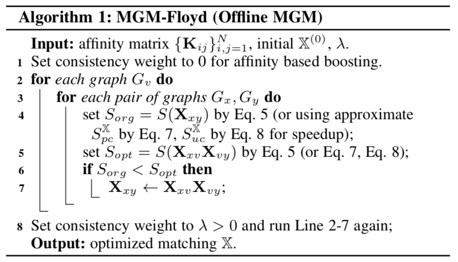
</center>

where $S \left( \mathbf { X } _ { i j } , \mathbb { X } \right) = \overbrace { ( 1 - \lambda ) J \left( \mathbf { X } _ { i j } \right) } ^ { \text{affinity score} } + \overbrace { \lambda C _ { p } \left( \mathbf { X } _ { i j } , \mathbb { X } \right) } ^ { \text{pairwise consistency} }$.  In practice we use the pc approximated version $S_{pc}^{\mathbb{X}} \left( \mathbf { X } _ { i j } , \mathbf { X } _ { jk } \right)=( 1 - \lambda ) J \left( \mathbf { X } _ { i j }\mathbf { X } _ { jk } \right) + \lambda \sqrt{C _ { p } \left( \mathbf { X } _ { i j } , \mathbb { X } \right)C _ { p } \left( \mathbf { X } _ { jk } , \mathbb { X } \right)}$. In this way we don't need to calculate pairwise consistency of the multiplied matrix again, but just multiply their original pairwise consistency value.

There are two rounds of updating $\mathbf{X}$, with each round traversing all graphs. In the first round $\lambda$ is set to $0$ for affinity based boosting. In the second round $\lambda=0.3$. Similar as acceleration of above, each pair of graphs are computated parallelly.

```python
def mgm_floyd(X, K, num_graph, num_node):
    """
    :param X: matching results, (num_graph, num_graph, num_node, num_node)
    :param K: affinity matrix, (num_graph, num_graph, num_node^2, num_node^2)
    :param num_graph: number of graph, int
    :param num_node: number of node, int
    :return: matching results, (num_graph, num_graph, num_node, num_node)
    """
    for k in range(num_graph):
        Xopt = np.matmul(X[:, None, k], X[None, k, :])
        Sorg = cal_affinity_score(X, K)
        Sopt = cal_affinity_score(Xopt, K)
        update = (Sopt > Sorg)[:, :, None, None]
        X = update * Xopt + (1 - update) * X

    for k in range(num_graph):
        pairwise_consistency = cal_pairwise_consistency(X)
        Xopt = np.matmul(X[:, None, k], X[None, k, :])
        Sorg = (1 - LAMBDA) * cal_affinity_score(X, K) + \
        	  LAMBDA * pairwise_consistency
        Sopt = (1 - LAMBDA) * cal_affinity_score(Xopt, K) + \
        	  LAMBDA * np.sqrt(\  # sqrt pc for approximate
            np.matmul(pairwise_consistency[:, k][:, None], \
            pairwise_consistency[k, :][None, ...]))
        update = (Sopt > Sorg)[:, :, None, None]
        X = update * Xopt + (1 - update) * X

    return X
```

+ **MGM-SPFA**

MGM-SPFA is based on SPFA, a single-source shortest path algorithm. It helps solve online multiple graph matching, which aims at matching the arriving graph $G_N$ to $N − 1$ previous graphs which have already been matched. Two constraints added: force termination when number of updated nodes reaches $m^2$, and pairwise consistency is updated every time two nodes get updated.

<center>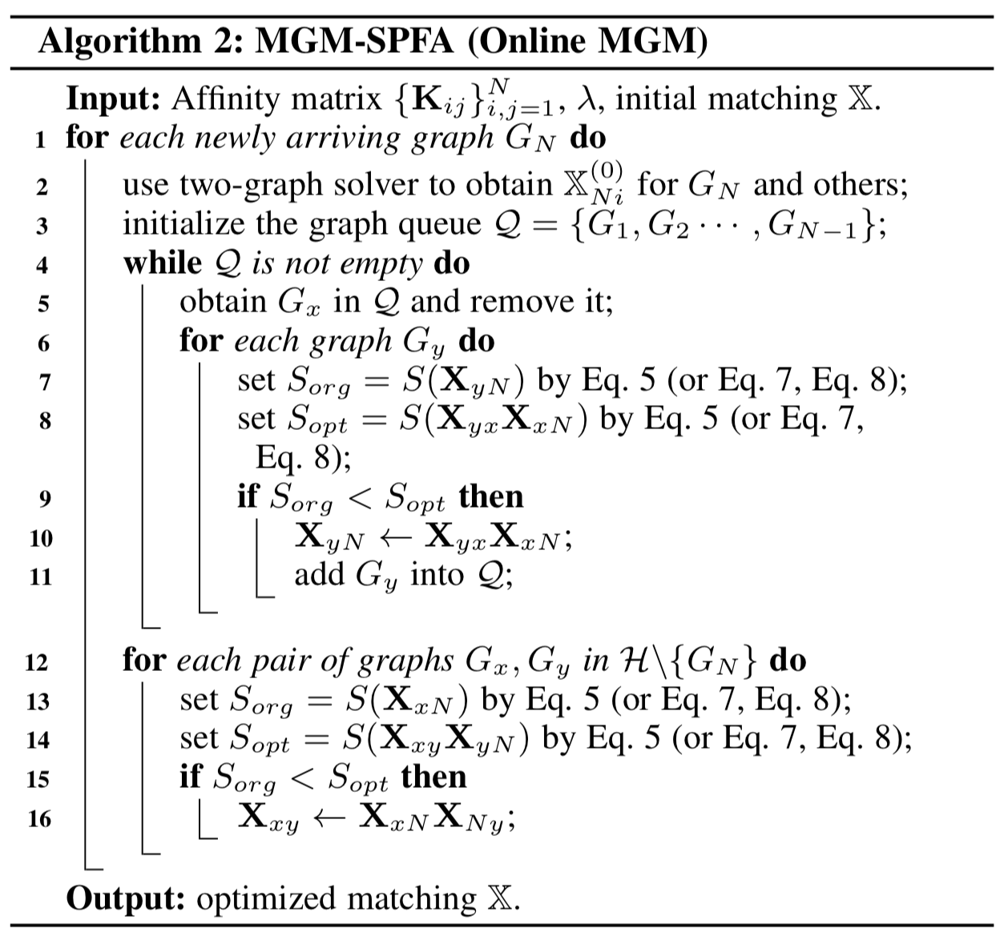
</center>

```python
def mgm_spfa(K, X, num_graph, num_node):
    """
    :param K: affinity matrix, (num_graph, num_graph, num_node^2, num_node^2)
    :param X: matching results, X[:-1, :-1] is the matching results obtained by last iteration of MGM-SPFA,
              X[num_graph,:] and X[:,num_graph] is obtained via two-graph matching solver(RRWM), We suppose the last
              graph is the new coming graph. (num_graph, num_graph, num_node, num_node)
    :param num_graph: number of graph, int
    :param num_node: number of node, int
    :return: X, matching results, match graph_m to {graph_1, ... , graph_m-1)
    """
    q = queue.Queue()
    outnumber = 0
    [q.put(i) for i in range(num_graph - 1)]
    pairwise_consistency = cal_pairwise_consistency(X)
    while not q.empty():
        Gx = q.get()
        outnumber += 1

        Xopt = np.matmul(X[:, Gx][:, None], X[Gx, :][None, ...])
        # X_opt[y,N]=X[y,x]·X[x,N]
        Sorg = (1 - LAMBDA) * cal_affinity_score(X, K) + \
        	  LAMBDA * np.sqrt(pairwise_consistency)  # sqrt for pc
        Sopt = (1 - LAMBDA) * cal_affinity_score(Xopt, K) + LAMBDA * np.sqrt(
            np.matmul(pairwise_consistency[:, Gx][:, None], \
            pairwise_consistency[Gx, :][None, ...]))

        Sorg = Sorg[:, num_graph - 1, None, None]
        Sopt = Sopt[:, num_graph - 1, None, None] # only consider the new added one
        update = (Sopt > Sorg)
        update[Gx] = False # skip Gx the graph itself

        X[:, num_graph - 1] = update * Xopt[:, num_graph - 1] + \
        	  (1 - update) * X[:, num_graph - 1]
        X[num_graph - 1, :] = update * Xopt[num_graph - 1, :].transpose((0, 2, 1)) + \
        	  (1 - update) * X[num_graph - 1, :]

        [q.put(y) for y in range(num_graph) if update[y]]  # add Gy into Q

        if outnumber % 2 == 0:
            pairwise_consistency = cal_pairwise_consistency(X)
        if outnumber > num_graph ** 2:
            break

    Xopt = np.matmul(X[:, num_graph - 1][:, None], X[num_graph - 1, :][None, ...])
    # X_opt[x,y]=X[x,N]·X[N,y]
    Sorg = (1 - LAMBDA) * cal_affinity_score(X, K) + \
    	  LAMBDA * np.sqrt(pairwise_consistency)  # sqrt for pc
    Sopt = (1 - LAMBDA) * cal_affinity_score(Xopt, K) + LAMBDA * np.sqrt(
        np.matmul(pairwise_consistency[:, num_graph - 1][:, None],\
        pairwise_consistency[num_graph - 1, :][None, ...]))
    update = (Sopt > Sorg)[:, :, None, None]
    update[num_graph - 1] = False
    update[:, num_graph - 1] = False #Gx, Gy in H\GN
    X = update * Xopt + (1 - update) * X

    return X
```

Here some redundancy is made: all the pairwise `X_opt[i,j]` are calculated, while only `X_opt[i,N]` is needed. However this may not downshift time complexity a lot, since it's parallelized computation. What inpacts most is to add `Gy` back into queue `Q`. If this line is commented time and accuracy both pass the test. But with it, time test fails.

+ **FAST-SPFA**

-
### 2. Question and Observation
<center>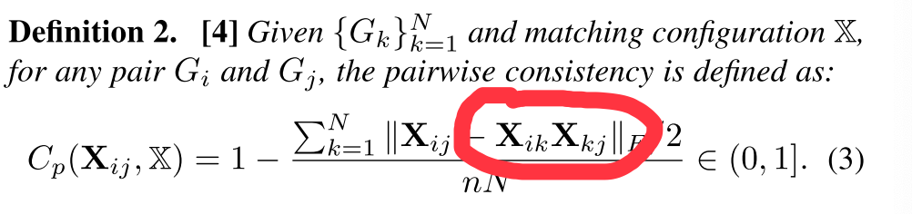 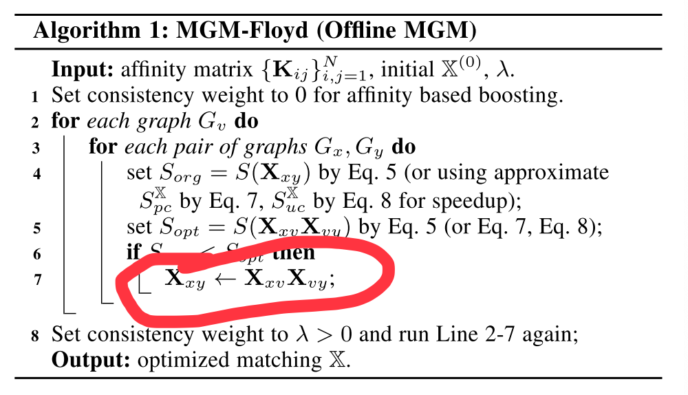

<font color="grey">We are curious about whether $X_{ik}X_{kj}$ should be pointwise or matrix multiplication, for each of the cases</font>
</center>
Author Jiang Zetian has kindly answered our question:
>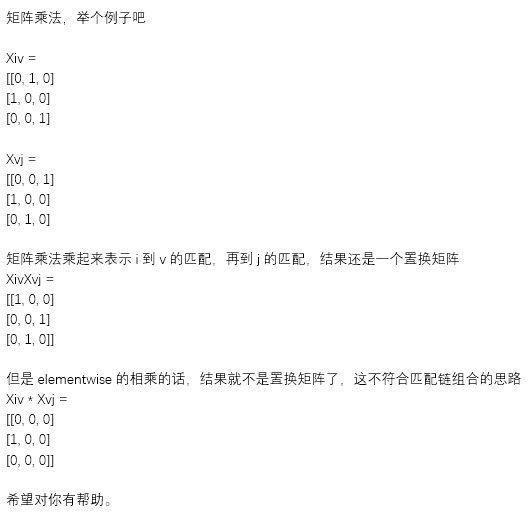

From the aspect of matching chain combination, it should be matmul here to maintain a permutation matrix. What we found interesting, however, is that if pointwise-mul is used in pairwise consistency computation rather than mat-mul, higher accuracy can be achieved (let alone speed). We would like to remain it here and research more thoroughly in the next big project.


-
### 3. Results Screenshots
<center>
<table>
<thead>
  <tr>
    <th colspan="2">Offline Floyd</th>
    <th>Car</th>
    <th>Motorbike</th>
    <th>Face</th>
    <th>Winebottle</th>
    <th>Duck</th>
  </tr>
</thead>
<tbody>
  <tr>
    <td rowspan="2">Time Cost<br>(s)</td>
    <td>Required</td>
    <td>4.384</td>
    <td>4.227</td>
    <td>4.220</td>
    <td>4.339</td>
    <td>4.209</td>
  </tr>
  <tr>
    <td>Ours</td>
    <td>1.999</td>
    <td>1.950</td>
    <td>1.903</td>
    <td>1.889</td>
    <td>1.938</td>
  </tr>
  <tr>
    <td rowspan="2">Accuracy<br>(%)</td>
    <td>Required</td>
    <td>60.46</td>
    <td>80.51</td>
    <td>91.08</td>
    <td>72.20</td>
    <td>57.69</td>
  </tr>
  <tr>
    <td>Ours</td>
    <td>82.56</td>
    <td>92.27</td>
    <td>95.34</td>
    <td>91.24</td>
    <td>76.93</td>
  </tr>
</tbody>
</table>

<table>
<thead>
  <tr>
    <th colspan="2">Online SPFA</th>
    <th>Car</th>
    <th>Motorbike</th>
    <th>Face</th>
    <th>Winebottle</th>
    <th>Duck</th>
  </tr>
</thead>
<tbody>
  <tr>
    <td rowspan="2">Time Cost<br>(s)</td>
    <td>Required</td>
    <td>2.190</td>
    <td>2.179</td>
    <td>2.023</td>
    <td>2.631</td>
    <td>2.135</td>
  </tr>
  <tr>
    <td>Ours</td>
    <td>0.828</td>
    <td>0.815</td>
    <td>0.857</td>
    <td>0.821</td>
    <td>0.850</td>
  </tr>
  <tr>
    <td rowspan="2">Accuracy<br>(%)</td>
    <td>Required</td>
    <td>63.32</td>
    <td>83.43</td>
    <td>91.41</td>
    <td>75.23</td>
    <td>59.05</td>
  </tr>
  <tr>
    <td>Ours</td>
    <td>71.74</td>
    <td>88.56</td>
    <td>93.94</td>
    <td>84.19</td>
    <td>68.64</td>
  </tr>
</tbody>
</table>
</center>
<center>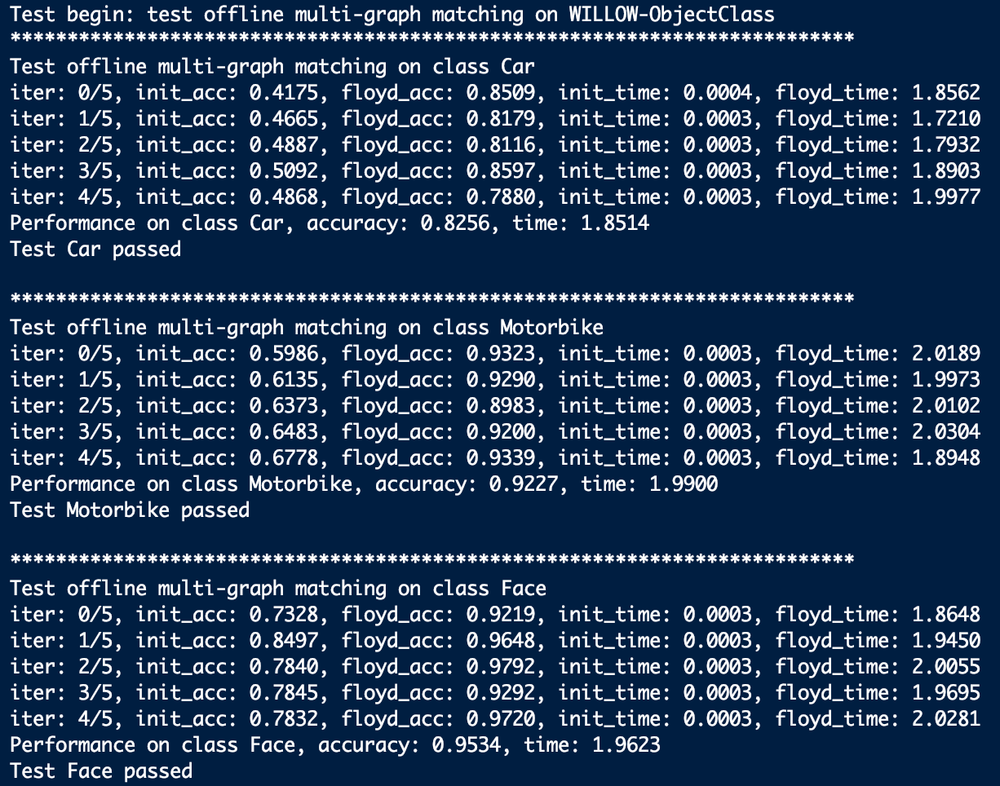 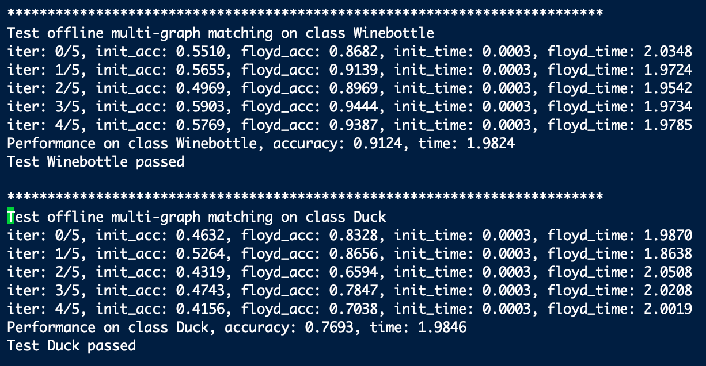

<font color="grey">Offline test using MGM-floyd passed</font>
</center>
<center>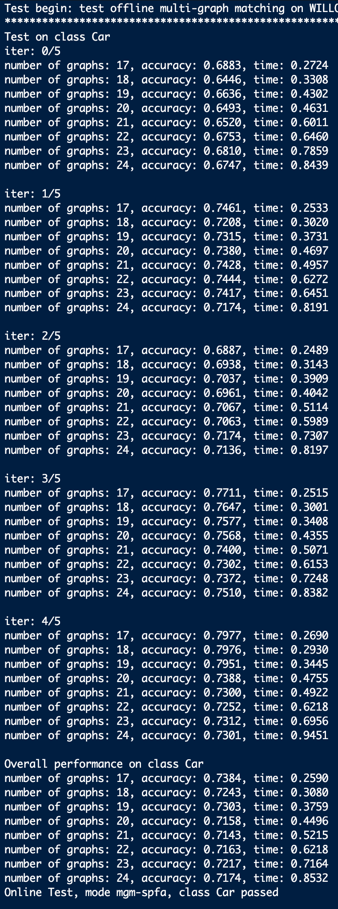 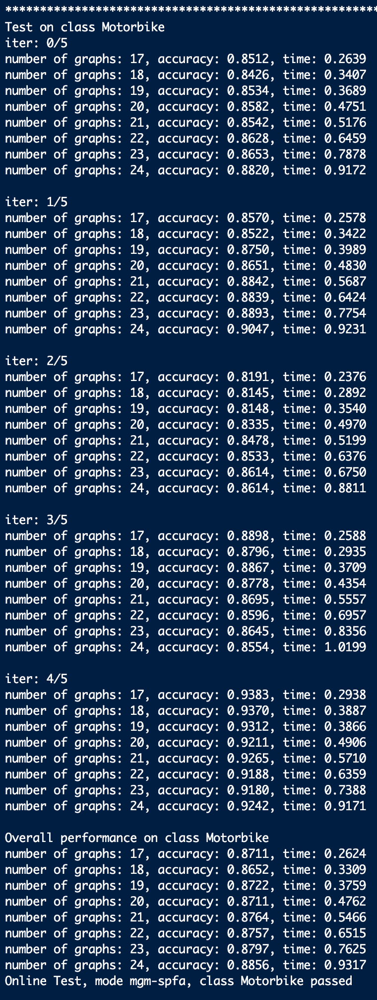 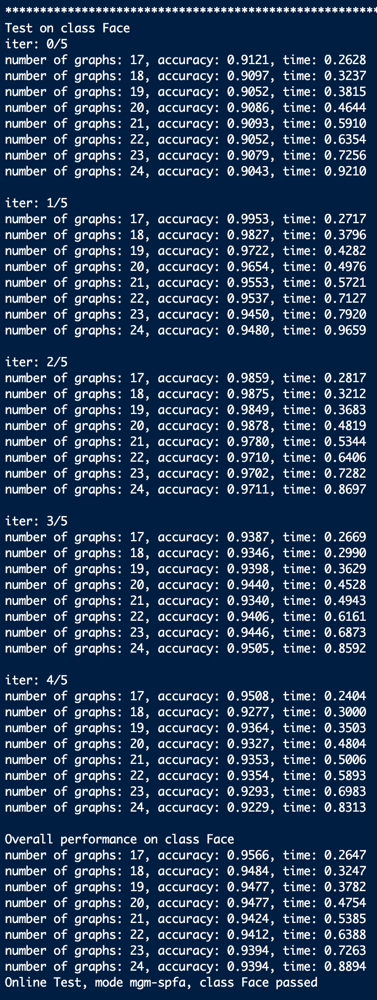 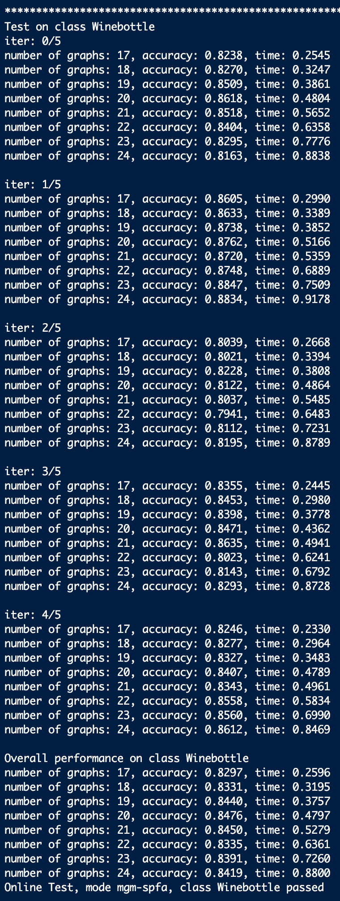 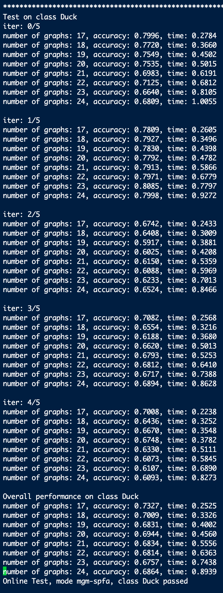

<font color="grey">Online test using MGM-SPFA passed</font>
</center>